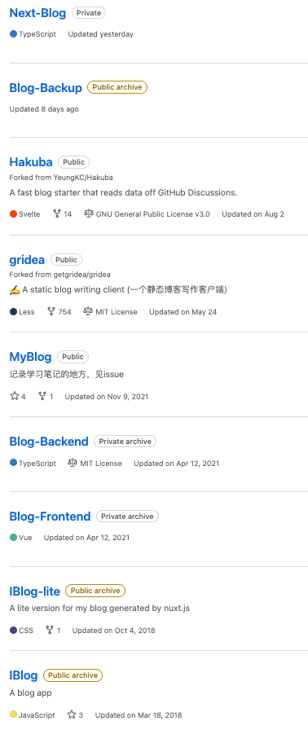
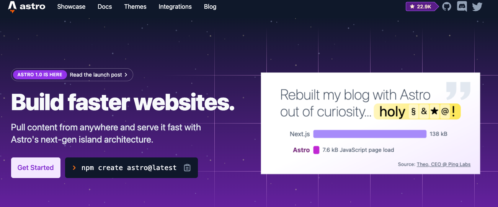

# 前言

终于，这一天来了

翻翻仓库，这已经是我写的第 n 个 Blog 了，前几次应该还是在大三找实习的时候，为了积累面试谈资整了一整套前端博客，后端服务加管理系统，但是也跟随一次云服务器过期，数据被删除，永远的离开了

  

由于维护成本巨高，后面再也没有动过写 Blog 的念头了。有折腾的精力读读书，写点东西不是更香，所以一度弃用了 hhh

在各种机缘巧合下，各种要素终于达到化合反应的标准，我又开始尝试写 Blog 站点了，为了避免这次重蹈覆辙，我仔细分析了下，我为啥需要这么一个站点？

# Blog 能为我们带来什么

- **个人品牌**
  - 这一点在技术层面最为显著，大部分的技术大佬都拥有自己的 Blog 站点，内部记录和分享了很多高质量的分析和思考的结论，顺着博客列表翻一遍基本都能收获颇丰
- **低门槛编写成本**
  - 这里主要想的是对于自己编写内容质量的门槛，在现有的大部分社交平台上分享各类文章，往往需要对内容进行反复修改多次加工，往往很多想分享的内容经过这种隐形成本一挡，都感觉不值得写了，这些零星冒出来的火花可能就此熄灭了，有点可惜
- **自由度**
  - 相信大家不止一次的对于某些平台的阅读体验提过优化建议，这里配色不行，那里广告碍眼，这里生态封闭，那里审核严格
  - 想要的某些功能的直接实现，就差一个程序员了
- **技术实现**
  - 对于程序员来说，自建站是一个最好的技术实践入口。如果你想，Blog 内部几乎包含了所有可以尝试的技术场景和技术栈，是一个非常好的练兵场
- **产品实践**
  - 对于产品也是如此，个人 Blog 就是一个小小的产品，它可以包括你对于这种形态的内容载体的所有思考，麻雀虽小，五脏俱全

如果以上内容你有 3 点以上共鸣，那感觉继续看下去应该会有所收获

# Blog 应该如何搭建

首先，得想想**需求**是什么，每个人的需求都不一样，有些人只是希望有个地方记录自己的碎碎念，有些人希望这是自己的一个作品集，有些人希望这是一个炫技的场地

不同的需求对应的最佳实践也有所不同

## 梳理需求

我简单想了想，我的需求应该如下：

- **低配置维护成本。** 避免因为成本再次弃坑
- **数据自我管理。** 数据放在自己这不仅可以非常自由的表达看法，并且为日后的迁移做好考虑
- **国内可访问**。这一点实际上目前非常重要，大部分非常优秀的建站工具的产物，国内无法访问，十分可惜。如果是技术向文章则无碍，但是目前还是希望能实现这点的
- **功能定制成本低。** 很多很好的建站，功能很不错，但是总觉得差点意思，改起来成本也巨高，只能将就用，但是我都自建站了，为啥还要将就，所以定制成本也得低
- **要有比较简单的可交互功能**（可选）
  - 评论
  - 点赞
  - 访问量
- ...

## 方案调研

在开始编写前，我也体验了不少 Blog 的技术选型了，梳理了一下现有的 Blog 实现方案和对应的优缺点，为大家提供一些参考：

- **自建前后端及数据服务**
  - 优点：满足对于自建站的一切幻想
  - 缺点：就是之前的方案，维护成本太高，云服务器配置费心伤神，如果不是技术大神有商业收入，慎入
- [**Gridea**](https://github.com/getgridea/gridea)
  - 优点：不需要懂太多技术，就能获得较高的自由度来完成建站
  - 缺点：
    - 有资源国内无法访问！加载闹心
    - 之前有用过 gridea + gitee 来实现，但是后面 gitee 需要实名注册，包括比较麻烦所以放弃了；并且 gridea 不再维护了，问题无人修复
- **github issues**
  - 优点：维护成本低，基本满足技术人员的 Blog 需求
  - 缺点：
    - 数据导出麻烦一些
    - 无法定制
    - 国内无法访问，交互成本高
- [**竹白**](https://zhubai.love/)
  - 优点：国内可访问，集成邮件和微信通知，可用性高，本质是 newsletter
  - 缺点：可定制化程度低，适用于非技术人员的纯内容输出
- [**hashnode**](https://hashnode.com/)
  - 优点：
    - 国内可访问，使用方便
    - 内容支持导出
  - 缺点：国内部分功能不可用，图床在国外，加载图片很慢（这一点让我直接放弃）
- [**掘金**](https://juejin.cn/)、CSDN、牛客等平台
  - 优点：使用方便，包含分发功能
  - 缺点：
    - 受众受限，只适合技术方向的文章
    - 属于公域，只能发能发的内容
    - 可定制功能少，ui 不好看
- **微信公众号**
  - 优点：
    - 包含推荐等分发功能
    - 微信内阅读体验极佳
  - 缺点：
    - 极度受限，自由度较低
    - 编写体验极差，基本只适合非技术方向的文章
    - 基本不可导出
    - 可定制功能少，编写成本高
- **github 等各类 pages**
  - 优点：
    - 使用成本低
    - 内容自己维护，完全可定制
  - 缺点：
    - 依然有 gfw 的问题，访问不了或者加载慢
    - 不支持 server
- ...

在各种方案都体验了之后，发现如果想达到我要的效果，还是逃脱不了写代码的成本，在机缘巧合下看到即刻里有即友分享 [fly.io](https://fly.io/) 这个部署平台，外加自己看到 **devaslife** 的这个 [youtube 视频](https://www.youtube.com/watch?v=3_JE76PKBWE&ab_channel=devaslife) 后，开始了现在的尝试

顺带说一下这个日本自由职业的开发小哥的视频水准确实棒，调色配乐和设计都是有东西的，确实是一个很厉害的全栈开发工程师

# 动手动手

到这里先说一声抱歉，下面的建站内容需要有一定的技术背景，如果是非技术的小伙伴，可能就要到此为止了；同时也可以参考上面的方案，当然如果想跟随尝试一下，那是最好不过的了

## 技术选型

本次综合各方面的技术选型结果如下：

- **前端：**
  - Astro.build
  - Tailwind
  - React
- **部署平台：**
  - Fly.io
    - Runner
    - Service
- **CI/CD：**
  - Github Actions
    - CI：build
    - CD：deploy

### 技术栈解析

#### Astro.build

  

[astro](https://astro.build/) 是一个类 hexo 的静态站点生成框架，非常适合用来搭建 blog，这里之所以没选择 hexo，主要是考虑可定制的程度和生态；而且文档写的也是相当不错

目前 astro 是支持 react 和 mdx 的，写起来基本上只需要写一些定制的组件就 ok 了，markdown 也是直接支持解析，用起来非常方便，并且产物的体积和性能整体来说还是很不错的

```bash
npm create astro@latest
npm run dev
```

#### Tailwind

两行搞定初始化，对应的 tailwind 集成也是有官方插件，直接加上就行

**这里有一个大坑需要说下，如果中间有定制 markdown 的解析插件 rehypePlugins，里面用到的类记得放到一个 astro 组件里，要不然 treeshake 给你丢了，折腾半天**

#### React

astro 支持各种框架的组件解析，这点还是很不错的，比较方便的就是直接用 react 写定制组件，基本没坑，像此处的 Header 和对应的功能也是直接写就ok

这里需要注意一下 astro 的 `Client Directives`，这个会控制 UI 框架如何在客户端集成，基本上开 `client:load` 就 ok

#### Fly.io

这个部署平台得说一下，是近期发现的非常优秀的平台了，主要有以下几点

  

- 大量资源支持免费试用，太香了
  - 支持免费试用 PSQL 和 Redis 实例
  - 支持免费使用 runner
    - 并且支持自定义 runner 资源的大小
- 支持自定义示例的机房（这个实例用的香港的，算快了）
- 目前 ip 还没有被墙，太香了
- 文档完善
- 配置流程简单

基本上按照文档流程，完成域名绑定和 dockerfile 的编写就 ok 了，省心

以上的优势基本上就秒杀了 vercel 和 netlify 了，但 如果不考虑 gfw，还是 vercel 香 hhh

**有一个小点，就是这里实例是需要静态服务 host 对应的 files 的，所以这里简单用 astro preview 来实现了，后续如果发现有问题，在尝试用 node 或者 deno 来 host**

#### Github Actions

关于 CICD，这类静态站点维护起来是最舒服的，直接 build 完 deploy 就行

这里 actions 的配置内容，等 Blog 稳定以后也会直接公开，大家到时候可以看看

## 达到的效果

- **前期需求基本满足。** 国内可访问这个虽然后续游客能被墙，那也已经是尽力而为了，国内目前还没有这么全功能的 sass 平台，leancloud 的体验实际上不佳
- **样式与功能**
  - 整体的样式和功能支持高度自定义，就是需要了解一下 astro 的一些 api，并且成本就和写 React 组件一样，也非常轻松
- **编写时体验**
  - 编写体验基本与写 markdown 一致，就是一些图片和视频，需要通过 markdown-paste-image 这类插件配合处理，比较麻烦一些，好处就是内容都是自己在 host，图床太不稳定了，之前 gitee 就出现过一波清空的情况
- **编写后部署**
  - 部署直接通过 git push 走 CD，不用关心后续的内容，很省心

# 结语

web 3.0 我不懂，但是关于个人站的分析我认为是没有问题的，**可能也许，在不久的将来 blog 将成为另一种个人的社交入口，链接众多志同道合的人，一个好的个人品牌能够快速拉近陌生人的关系，也能够提供一个对外暴露自己的契机，很多时候需要的只是这么一个小小的契机而已**

最后的最后，归根结底，Blog 是用来写的，最近也积累了很多想写的议题，比如**智能家居、上网自由，比如中医，比如 VIM 退出指南等......** 如果感兴趣的朋友欢迎通过 RSS 订阅；或者关注我的微信公众号：`晨阳再升`，基本上也会第二时间同步更新

咱们下次见

哦对了，如果有更好的 Blog 建站方案也欢迎找我聊聊嗷
