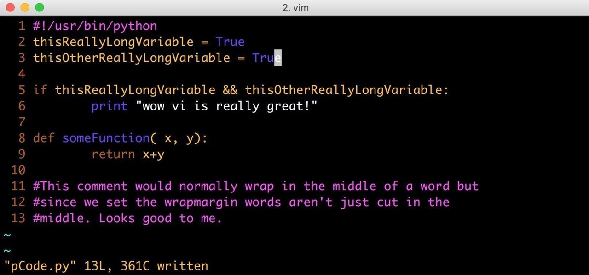
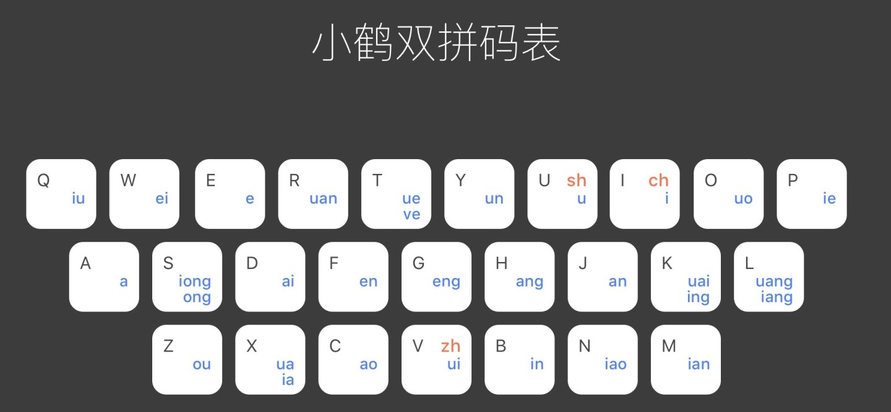
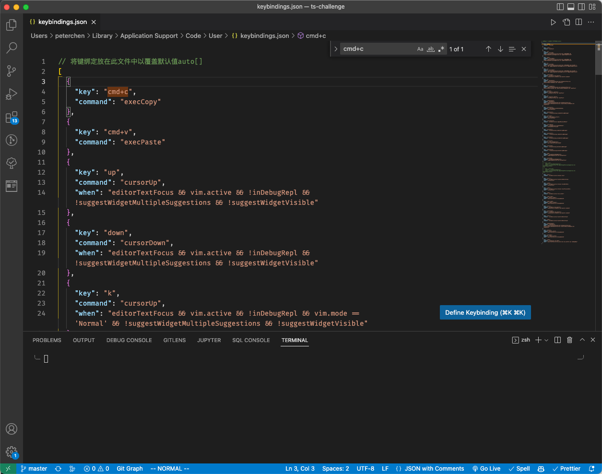
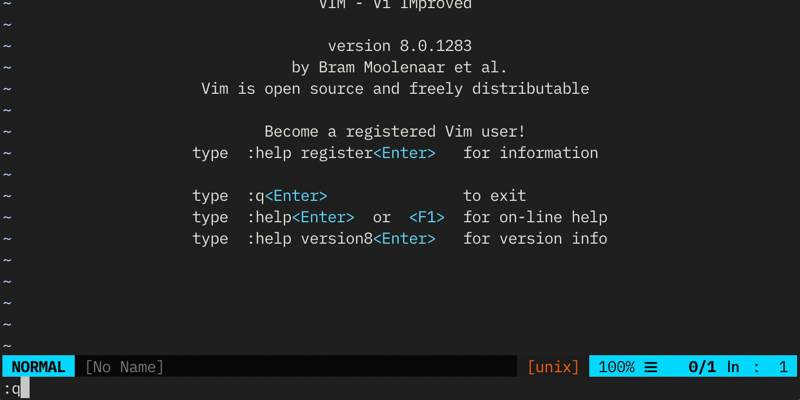

> **有人说，造出一个随机字符串的方法，就是让一个 Vim 新手进入 Vim，然后尝试退出**

不知道有多少程序员卡死在首次进入 Vim 的界面中无法退出，别的不说，我反正是卡住了

  

今天开了新坑，想记录一下我学 Vim 的心路历程。Vim 是很有年代的编辑器了，但是时至今日，依然有很多设计上的亮点，对于效率有追求的朋友们，欢迎尝试一下，你可能会有新的发现

# 啥是 Vim

> `Vim`是从`vi`发展出来的一个文本编辑器。其代码补完、编译及错误跳转等方便编程的功能特别丰富，在程序员中被广泛使用。和`Emacs`并列成为`类Unix`系统用户最喜欢的编辑器。 —— Wiki

vi 是 1976 年 比尔·乔伊（Bill Joy），本意是 **Visual**，来源于另外一个文本编辑器`ex`的命令`visual`；`Emacs` 也是同年出现的编辑器

**Vim = Vi IMproved**，老祖宗就是上面的 vi，Vim 距离 1991 年 11 月 2 日发行，距今已经存世 31 年了，但时至今日，在在学习的过程中，依然能够被这款编辑器的设计所打动，

上面这个👆不符合当代审美的编辑器，就是本系列的主角 `Vim` 了，他和我们现在用的各类编辑器 Notion、VSCode 和 WebStorm 没有本质不同，都是用于编辑各类文本的一种工具

但是不同的是，Vim 的使用环境不依赖于我们现在的可视化的操作系统，**它诞生在仅仅只有命令行的环境，也就是不支持鼠标！🐶**

这就意味着，它内部的所有功能都要通过键盘的单个按键，或者组合键完成，那么它是怎么设计解决方案，来容纳如此之大的操作需求的呢，**这将是分析和学习 Vim 的核心价值**

# 为什么要学 Vim

那既然我们现在已经有了可视化的操作系统，如 MacOS 和 Windows，有了强大的 IDE 如 VSCode 和 WebStorm，为啥我们还需要再学这个看上去已经离我们很远的老古董呢

对于我来说，排名第一️☝的出发点就是 **「提升工作效率」**

这里就不得不提到我前年学习的一个节约生命的高质量工具 **「双拼」**。双拼顾名思义，就是用两个按键解决所有的中文拼音编辑，大大提升了打字的效率

  

比如我打一个字“爽”，之前需要输入 `shuang`， 六个字母，现在只需要 `ul`，两个字母就能完成，直接提升 **60%** 效率

那么同理，我们每天切换鼠标和键盘的次数，和我们输入中文拼音的次数也不遑多让，如果我们能借助 Vim 来摆脱鼠标，那么提升的效率将会是非常可观的

在我重拾 Vim 之前，我其实就有通过学习当前 IDE 快捷键来摆脱鼠标的想法，结果发现，`现有的 IDE 快捷键，信息含量太低，根本不足以完成编辑操作`，所以当 Vim 重新出现在我视野里时，我抓住了它

除了提升效率之外，还有以下两点学习的好处：

- **提升工作效率**
- **Geek 必备**
  - 云服务器操作
  - linux 需要
- **保护手腕健康**

在之前折腾软路由的时候，就发现学会 Vim 真的能帮上忙，一些低配置的硬件压根无法安装可视化的操作系统，那么编辑内部文件，除了通过外部上传的方式，就是 Vim 了，所以这也是为什么 Vim 称为程序员基本功的原因了哈哈哈

提到保护手腕健康，这里我讲讲健康的工作姿势。18 19年在字节的时候，因为右手高强度的在 Mac 操控版和键盘间切换，导致手腕关节处十分难受，之前还得算去看骨科来着，但是后面我回学校以后就好了哈哈哈，那就明显证明问题是，使用手腕超过了限度，在此之后，我使用了人体工学的鼠标和键盘，帮助我解决了此问题，在后续逐步提升 Vim 强度以后，相信也能够帮大家减少程序员工伤的程度了 😂

# 如何学 Vim

我目前的方案是 VSCode + Vim 插件，来完成我的日常编码工作

在这个当前方案的探索中，我尝试了很多种方案，包括：

- 原生 Vim
- Emacs

在使用的过程中我发现，Vim 确实已经离现在的 ide 太远了，在 30 年前，可能他是效率工具，但是今天，原生的 Vim 编辑器已经不能说是一个好用的工具了，配置之繁琐，可调试性之底，完全和我学习的初衷背道而驰，并且加上了各种插件的 Vim 的性能属实还是和我们的现代 IDE 有很大差距，所以最后还是放弃了；当然，在 VSCode 中使用的键位依然能够在原生 Vim 中使用，只是没有那么方便而已，但是云服务器等场景的短时间编辑，是绰绰有余了

虽然 VSCode 和 Vim 的结合是一个天作之合，但是其中的冲突和解决过程依然是不可避免的

  

但是相对于我手动配置原生 Vim，来实现 VSCode 的功能来说，会是一个更好的选择方案

中间配置的一些踩坑内容，会随着文章不间断的更新，大家敬请期待

# 总结

**学习 Vim 会是一个比学习双拼更高成本的事情，我们可以慢慢来**

那么回到开头的问题，如何退出 Vim，答案是：进入 Vim 的 **command line** 模式，输入 :q 来退出，意思是 quit

  

这让第一次尝试了 ctrl+c、esc 和 exit 的我有些无奈，但是后面学到了 vim 的四种设计模式以后，我才理解，这么设计的良苦用心，那我们今天就到这，我们下次见

# 参考资料

每一期内，我都会把这个周期内，和这个主题相关的内容都列一下，感兴趣的朋友们可以点击查看里面的内容：

- vim source code: <https://github.com/vim/vim>
- 推荐 - vscode vim 教程：
  - <https://www.bilibili.com/video/BV1nW4y1Y78b?p=1&vd_source=366bb414305b3c2d4d8fdefe5b587d14>
- vscode vim 教程：
  - <https://www.bilibili.com/video/BV1z541177Jy?p=6&vd_source=366bb414305b3c2d4d8fdefe5b587d14>
