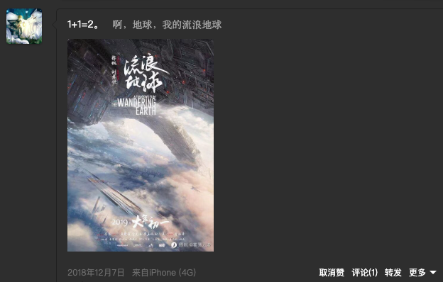

> 这是一部未来的九分电影

# 看前：存疑的续作前传

我在 18 年最早听说流浪地球影视化的时候，我就激动的在空间发过一条动态，**但是当时更多的并不是对于中国科幻的一种期待，而是对于大刘作品终于影视化的一种感慨**

  

翻看导演和演员阵容的时候，我当时内心是拒绝的。**一个只拍过《同桌的你》的导演，配上战狼和吴孟达，能拍出什么，我想都不敢想**

但是作为大刘的忠实粉丝，我必然是大年初一就到电影院支持的，还记得当时应该是只有我去看小破球，家里人和亲戚去看的其他电影，但是从电影院出来，我的内心是震撼的，只能说郭帆 NB！晚上回来立马在床上写了一大段的影评

我是一个从来不写影评的人，能让我哗啦哗啦写一大段的，也只有国内科幻电影的里程碑了

当时看完以后，内心最大的感受是，这是中国版的流浪地球，大刘的作品是世界级的，需要更多有创意的人来演绎，就像被各国不断翻拍的各种经典作品一样。其实现在回想，这么说的话，其实自己对于第一部的质量还是有所不满的😂，认为没有完整表现大刘作品中，那么完美的世界观与对人性的审判和讥讽

**但是，这部电影却是我第一部二刷的电影。** 第二天，我也带爸妈，再次二刷了这部电影，当电影展示了那段，从地表到太空的长镜头的时候，我再次热泪盈眶，因为这才是带有中国烙印的科幻电影，这是独属于科幻爱好者的强烈共情。看完以后，也跟爸妈聊了下，他们也能看懂第一部中这类典型的好莱坞叙事风格，目的单一，特效过硬，这就是一部好电影

**聊完第一部，回过头来看看第二部。**当时听说第二部要拍的并不是故事线后续的氦闪危机，而是前传时，我的内心是拒绝的

很多电影和电视剧，后续更新不按时间线继续拍摄，而是往前拍前传，往往是一个比较有风险的选择。一个是作为观众来说，观看的惯性被停下来了，需要主动的去思考和重新补充上一个故事的相关内容，如果拍摄手法和剧本没有新的突破的话，很容易让观众感觉是在炒冷饭；其次作为原著迷来说，小说的高潮就是氦闪危机，往前推，需要考验导演对于小说内核的深度思考，而如何用一个可以搬上大荧幕的方法，在氦闪危机之前，把人性的劣根性毫无保留的在大年初一的荧幕上展示出来，是一个很有挑战的事情；最后是一个是作为导演来说，第一部仅仅是借用了大刘设计的世界观，木星危机的核心情节完全是自己和编剧龚格尔原创的，在第二部中如果需要延续或者再创第一部的辉煌，需要的工作量肯定是指数级的。所以郭导才上映前的节目中也表示，主要是希望吴京能够参演，所以在六七个剧情线中选择了前传这条线，而且还采用了最为困难的编年体电影格式

但是，我相信能拍出流浪地球 1 的郭导不会让观众失望。从前期预热的多部预告片来看，郭导对于电影剧本容量的自信溢于言表，而且片场接近 3 小时，这是很多糊弄观众的导演想都不敢想的，面对的拍片压力和编剧压力是巨大的，很可能翻车

好在，一切都在电影开始后的五分钟，得到了答案

# 看中：依然用心，依然热泪盈眶

> 剧透警告：没看过的话，现在退出还来得及 ⚠

在开场的太空电梯危机前，导演给刘培强加了很多感情戏，很多观众也觉得，这些内容完全可以压缩，为后面更重要的剧情让路。但是我认为，完全没必要。讲故事都需要从小的切入点切入，刘培强这一家，就是末世下一位普通人的一家，如果不多给一些镜头，后续刘培强老婆罹患二型辐射病的分别，就无法让观众共情末世下，一个家庭残忍的分崩离析

平铺直叙的特效爽片，不是大刘的作品风格，也不是郭帆的导演追求。第一部这么拍也只是能力不够的妥协，并不代表第二部就需要这么拍

就如图丫丫和刘德华的这条线，就有观众觉得，感情不够饱满，人物动机不够强烈。没有一种叙述方式，也没有一部电影能让所有人都满意，这也是电影评价永远会出现两极分化的原因，只是严重程度不同罢了

太空电梯启动的那一刻，我就知道，这四年的剧组努力都没有白费。严谨的机械设计、华丽的电梯接驳程序、国产第一空战电影和太空站坠落的特效模拟，哪一项都让我这个科幻迷直呼过瘾，这和见到第一部里万里冰封的感觉是一样的，这种激动，也许只有科幻迷能够理解

除了太空电梯里的一些打斗设计让我莫名想到太空战狼这个词哈哈哈，只能说吴京肯定在打斗设计上除了不少力，但是可能观众就爱看这个，少了点科幻味的同时，锻炼一下剧组的打斗拍摄技能也是不错的

之后的内容是在吴京线，刘德华线和李雪健老师线来回切换，直到月球危机的出现。这里有很多观众觉得剧情松散，发展不够线性，很乱。我首先认为这个并不是剧本的问题，至少不是主要问题，编年史的剧情结构本身，就是一种类纪录片的展示模式，这是郭导为了追求大刘所说的「最好的科幻片，就是纪录片」信条而做的一种尝试；其次，多线叙事本身对于剧情的理解就需要观众的参与，并不是一条线起承转合，而是多条线交纵连横，最后意外交错的一种导演和观众的默契约定，看过诺兰电影的话，应该能够体验到这种剧情设置的魅力

在月球危机出现时，我一直在想，这部电影摄制两个剧情容量，太大了，对于受众的理解能力是不小的挑战。事实也是如此，好像最终成片删除了 80 分钟的内容，这个电影长度完全可以拆成两部电影上映了，但是郭帆没有这么做，我猜啊，我猜，第三部的内容大纲已经写得差不多了，已经塞不下了🐶

月球危机的剧情的设计，有点让我出戏到月球陨落，而且最后一分钟营救的模式和木星危机有一点太像了，有点审美疲劳。但是解决方案的一波三折，确实是剧情设计的亮点

最终全员上月球手动解决引爆问题时，我差点就以为，沙溢会说，中国全体出列，上飞船的国家主义的个人英雄情节出现😂，还好还好，导演的设计让我放松了一口气

与月球危机关联的地表互联网连结的情节，我想郭导更多的是想为全片的暗线服务而设计的，但是整体的剧情容量却是有点太大了，这一部分，我感觉反而是不那么出彩。关于 97% 坚持点火撕裂地球被喷是大国独裁这件事，我只能说是绷不住了，这是科幻片兄弟，看不懂可以不看

最终 🌍 成功离开月球，开始起航的那一刻，真的是感慨万千。第一部里，大家解析这种带着地球离开的行为是东方文明，对故土的一种眷恋，我其实是感受不深的。但是假设这一幕是，大家乘坐飞船离开，地球被撞的稀烂，对于东方人来说，这可能真的说不上是一种胜利吧

片尾最后有彩蛋，也隐藏了整部电影最大的暗线，就是 MOSS 的人工智能线

# 看后：再次为中国科幻鼓掌

**第一部，我给了 8.5 分，这一部，我给 9.5 分**

对决策的

隐藏线的解析。第四条线 moss 毁灭 变数 看到了不同的未来 看到了人类顽强的生命力 改变看法 升纬 改变过去 改变未来

对人类共同体的思考。理想化的中美关系

对于人类物种的思考。流浪地球是一种人类伟大品质的艺术化浪漫体现

但是这一部中当然也有很多可以继续优化的点，但是对于一个很挑剔的人来说，我已经很难找出来了。

---

对比 我的三体

三条线的个人理解

方舟计划的失败 章北海

叛军背后有国家级的支持

火种计划的失败 moss 从未叛逃

伏笔 防空系统
相信人类一定会成功的周老

特效 太空电梯和领航员号出现即泪目

人类命运共同体 人类的赞歌就是勇气的赞歌

编剧水平 衔接 月球陨落 三体
太空电梯危机
月球危机
笑点衔接好多了 但是房价低了有点半天才 get
人物设计 沙溢太不错了 李雪健老师 耶路撒冷和邓小平 告知不是征求意见 略尬

对于扣细节的敬意 练琴

人类走的太远了 如三体文明游戏一样
亲情是最好的剧情
类型片成熟之作

剧情 空战 科幻 人文

配乐

分镜

宿命论
命中注定 命中有时终须有 苦难是文明发展的必然历程

两种方案人类无意义的争端和斗争 把最精密的密码设计留给了毁灭对方的武器

宇宙之大 人类文明之小
太空 上海 月球 我们都太小了 人类就像虫子 感恩现在所有的一切

为人类理想主义的人类文明逃亡史 渺小 但又伟大 的历程 鼓掌

好的科幻片 像纪录片
