- [前言](#前言)
  - [背景](#背景)
  - [书籍介绍](#书籍介绍)
- [主要内容](#主要内容)
  - [为什么越无知的人越自信](#为什么越无知的人越自信)
    - [病觉缺失症](#病觉缺失症)
    - [达克效应](#达克效应)
      - [介绍](#介绍)
      - [原因](#原因)
  - [为什么我们的认知过程会出错](#为什么我们的认知过程会出错)
    - [元认知过程不完善](#元认知过程不完善)
    - [经验和反馈未必能带来最优解](#经验和反馈未必能带来最优解)
    - [虚假的独特性](#虚假的独特性)
    - [道德优越感错觉](#道德优越感错觉)
  - [如何更加客观的看待这个世界](#如何更加客观的看待这个世界)
  - [对我自己有什么改变](#对我自己有什么改变)
- [总结](#总结)
- [其他](#其他)

# 前言

## 背景

这是今年第一次线下读书会的分享文稿整理，五个月前 3.19 号办的，但是整理内容拖到了现在哈哈哈，其实最开始没想着整理成文稿，但是发现这本书里的内容，在近段时间内还是能够被时常想起，证明还是有整理的价值的，所以整理出来，跟大家分享分享

  

书的整体内容编排，其实并没有特别吸引人，包括全文都没有插图，读起来其实还是有点费劲的，案例也都是国外的案例，代入感差点意思。但我在樊登读书上听樊老师讲过一次，感觉欸还有点意思，所以就选了这本书作为线下读书会的主题

一方面，我最近两年也刚好对 **理解他人 和 理解自己** 的这个生活命题有了些觉知，发现有点意思，想看看他人的看法；另一方面是第一次办线下读书会，从调研角度来看，选择的书籍最好还是大家生活中能够有所共鸣的类型，比如心理学和社会学相关的书，比如是 **亲密关系、非暴力沟通、爱的艺术 和 置身事内** 这种，也会更容易有思维的碰撞

## 书籍介绍

那先和大家介绍下这本书

不知道大家听到这本书名的第一印象是什么，我的印象就是和 普通却自信 的这个比喻很像，他 怎么怎么样，那么普通有那么自信。这个名字很明显是一个贬义词，感觉作者有点过于轻蔑了👀，难道是一个教人如何怼人的书吗哈哈哈

但是实际上，正如作者书籍的原标题：`Self-Insight: roadblocks and detours on the path to knowing thyself`

**了解自己的道路上的障碍和弯路**

所以说翻译背大锅，**这本书的内容看似是攻击他人的利器，实际上是一面审视与分析自己的镜子**

介绍完了书的标题，我们再看看作者

作者是大卫邓宁，在2021年，被斯坦福大学列为被引用次数最多的前 2% 的心理学家，并且他和克鲁格一起提出了非常有名的 **达克效应** 的概念，也会是我们今天分享的重点之一

# 主要内容

**在开始前，大家可以在心中想想下面两个问题：**

- 会开车的朋友：自己的驾驶水平，在所有司机中，应该是排在多少分位
- 不会开车的朋友：自己的运动水平，在所有的同龄人中，应该是排在多少分位

之所以问这个问题呢，就是为了和今天书籍的主题相呼应，后面内容中揭晓👀

## 为什么越无知的人越自信

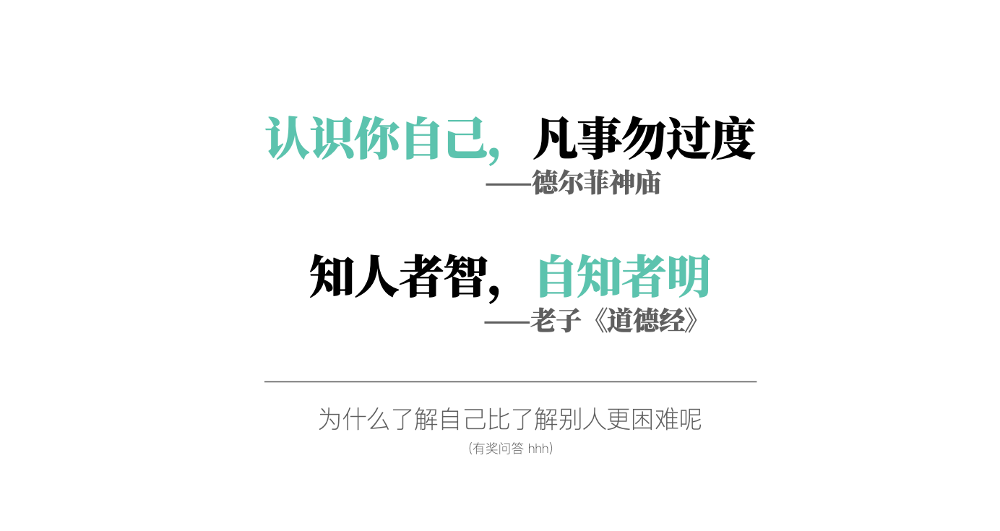  

> 知人者智，自知者明 —— 老子《道德经》
> 
> 老子認為能察言觀色，認識別人的才分性情、賢愚善惡，可說是有智慧的人；不過唯有能深自內省、認識自己的人，才是有明德的人

### 病觉缺失症

举几个生活中的例子，买股票，会认为自己的选股能力比他人强；买彩票，会认为自己抽的比店家给的更容易中奖；这些都是比较常见的自我**高估**的现象，这实际上并不是我们真实的水平

**那么为什么会出现这种对自己真实能力的错误认知呢**，这里作者提到了一个概念叫 **病觉缺失症**

在我们身边，经常能看到老年人有这种症状。我们给他买了助听器，说“你听不见，你要戴助听器”，但他们经常很排斥戴助听器。老人会说“我能听见”，你就只能很无奈的说“你看，刚那句话你就没听见”，老人说“那是你说太快了，你那句话说慢点我就能听见”

这实际上是他不愿意承认自己的听觉不行了。这种对自我认知的缺失，就是病觉缺失症的一种体现，表现在我们对自我认知完全无感。

作者和他的学生发现并命名了这种现象，就是 达克效应，也叫`邓宁-克鲁格效应(The Dunning-Kruger Effect) `

### 达克效应

  

#### 介绍

**即个体在某个领域的技能或知识水平越低，往往越难以准确评估自己在这个领域的能力**

- 这导致他们可能高估自己的能力，而实际上他们可能并不擅长该领域
- 相反，有真正技能或知识的人往往更加谦虚，更能准确评估自己的能力

之前读书群里也有讨论过这个话题，`如果你感觉这个东西很简单，那要么你一无所知，要么你是行业专家`

#### 原因

为什么会出现达克效应呢，作者指出原因 `是我们的元认知存在缺陷`

**那么什么叫认知，什么叫元认知**

- **认知**我们懂，比如说投资领域，所需要的技能和知识叫作认知
- 那什么叫**元认知**呢，我们对认知的程度的了解就叫做元认知，比如说我对我自己的投资水平高低的评价，这就是一种元认知

这是两个不同的概念

为什么元认知会存在缺陷呢，因为认知是元认知的基础，而认知是需要后天不断学习提升的。**当你不会做这件事的时候，你也难以评估自己的表现。**

作者举了几个例子：

- 医生要**准确评价**自己是否为患者作出了最佳诊断，前提是他熟知这种疾病症状
- 语文老师要给学生**提供有效建议**，前提是其精通语文规范
- 税务会计要合理**评估自己给客户的建议**，前提是其通晓税法

如果上述人员的专业知识存在欠缺或不足，那么他们就无法对自己的行为作出正确评价

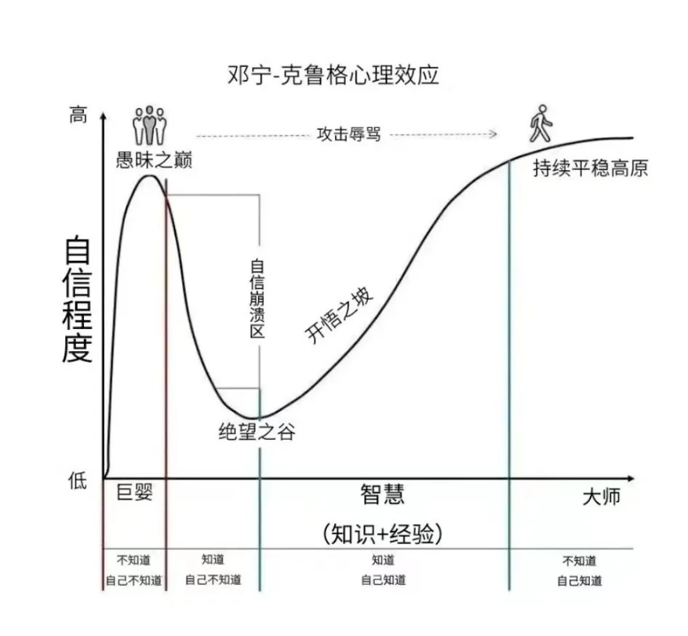  

仔细想想，这是一个很恐怖的循环。**认知不足导致元认知存在缺陷，元认知存在缺陷又导致自认为不需要提升认知**

这是作者解释的，我们为什么会出现达克效应的原因

## 为什么我们的认知过程会出错

### 元认知过程不完善

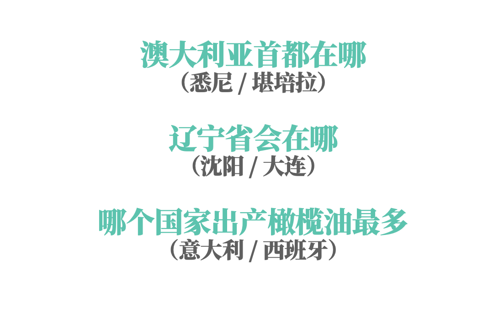  

- 澳大利亚首都在哪
（悉尼 / **堪培拉**）
- 辽宁省会在哪
（**沈阳** / 大连）
- 哪个国家出产橄榄油最多
（意大利 / **西班牙**）

这里的几个问题大家都答对了吗？如果没有的话，你看看作者怎么说

**这里作者介绍了出错的第一个原因：`元认知过程不完善`**

怎么个不完善法呢，作者在这里从四个角度阐述了我们元认知不完善的场景

- **第一，我们之所以会产生元认知的问题，是因为我们的知识没有错，但是，可能不全面**
    - 想到樊登老师说他自己的例子，他去过意大利，感觉橄榄树太多了，那肯定是意大利啊，但是实际上他没去过西班牙，不知道西班牙的橄榄树其实更多
    - 这让我想到齐老师的一个比喻，投资这个领域，也是比较容易出现这个问题的。投资如果只懂一点，还不如不懂；这和作者的意思不谋而合，不全面的知识可能会带来完全相反的结果
- **第二，我们的知识只是大致无误，但是会有瑕疵**
    - 比如澳大利亚的首都容易记错，可能是因为悉尼歌剧院出场机会比较多🤔
- **第三，很多知识是伪相关的，他们之间并没有关系，但是我们潜意识会拿他们随便类比**
    - 比如书中有一幅图，问 切断绳子以后，小球会如何运动
        - 选 A 的受访者认为：会接着转，因为地球和太阳间也没有绳子
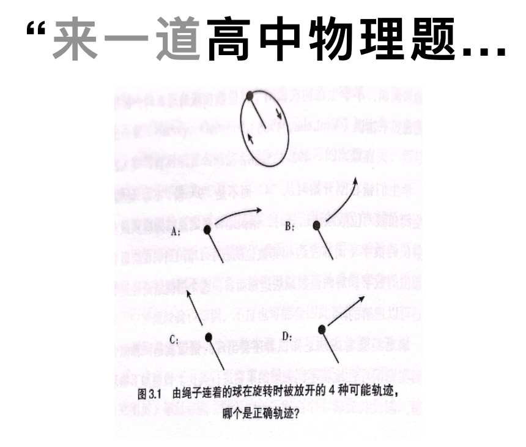  

- **第四，证实偏差，人类有一种能力就是能够论证任何观点**
    - 这也是玄学能够长期存在的原因，无贬义，我本身也喜欢研究非自然的玄学，这里想提到的是，我们需要要客观看待这种心理，避免被别有用心之人利用👀
    - **人们更关注证明信息，而不是否定假设**
        - 有这么一段话，你看看准不准：你是一个表面看起来很快乐，内心很忧郁的人。有时候很果敢，有时候又犹豫很久。有时候会很热情，有时候又会很冷漠，有时候很随便，有时候又会认定一个东西不放弃
            - 相信大家都会觉得很准，对吧，这个叫 **巴纳姆效应**
            - 其实所有人都会有这样的情感波动，并不神奇🤣
        - **对自己的选择过于自信**
            - 只能看到对自己有利的证据
        - **第一印象变的非常重要，扭转第一印象十分困难**
            - 他是个好人，做的啥都是对的
            - 他是个坏人，做啥都是不怀好意

### 经验和反馈未必能带来最优解

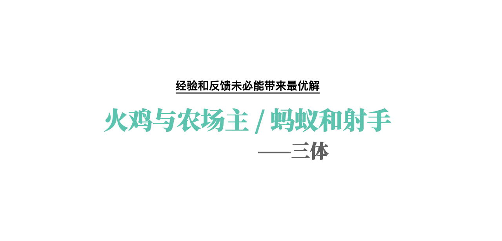  

我是大刘忠实的粉丝，作者讲到这个点，我就立马想到了三体里的这两个小故事

- **火鸡和农场主**
  - 一个农场里有一群火鸡，农场主每天中午十一点来给它们喂食。火鸡中的一名科学家观察这个现象，一直观察了近一年都没有例外，于是它也发现了自己宇宙中的伟大定律：“每天上午十一点，就有食物降临。”它在感恩节早晨向火鸡们公布了这个定律，但这天上午十一点食物没有降临，农场主进来把它们都送到餐桌上了
- **蚂蚁和射手**
  - 有这样一群生活在靶子平面上的蚂蚁，蚂蚁中的科学家某天观察后宣布，自己发现了一个伟大的定律：“宇宙每隔十厘米，必然会有一个洞。”但是实际上，这只是射手无意为之的结果
  - 它们把这个射手一时兴起的随意行为，看成了自己宇宙中的铁律

当然这两个例子比较极端了，但是很能体现这个**完善的认知未必能带来最优解的意思**。那么我们所获得的经验反馈可能有哪些原因导致偏差呢：

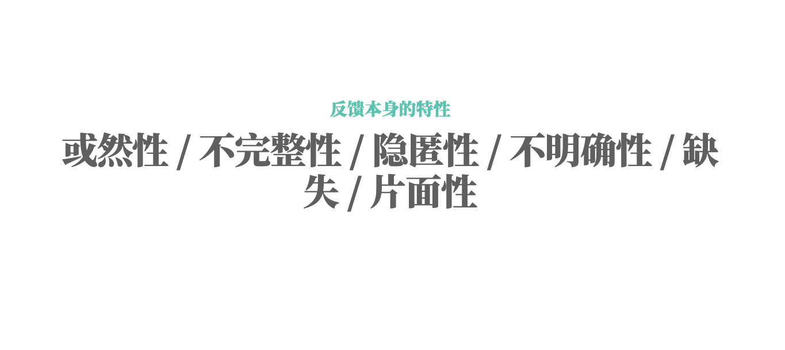  

- 反馈的或然性
    - 前提与结论间不具有蕴涵关系，即从前提出发，不能必然而只能*或然*地推出真结论的推理
    - 正确的选择不一定能带来好的结果，错误的选择也不一定带来坏的结果，和下一个特性一起介绍案例
- **反馈的不完整性**
    - 反馈只能反应一部分，比如很多妈妈谈教育孩子，打孩子，不哭了，听话了，那就有用。但是会给孩子带来身体和心灵上的伤害
- 反馈的隐匿性
    - 反馈可能不可见，比如可能谈判的成交价格还可以再往下降，但是你不知道
- 反馈的不明确性
    - 比如相亲失败，你可能永远也不知道原因是什么
- 反馈的缺失
    - 能力不够的管理者，员工工作上做的不好难于启齿，无法做出正确的反馈
- **反馈的片面性**
    - 演讲者讲得不好，但是观众为了人情的故作没有揭穿，还说讲得好

**除了他人的外部反馈存在偏差之外，我们在接受反馈时，我们还有很多错误习惯：**

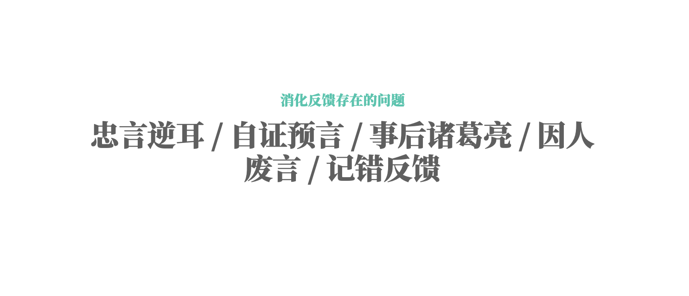  

- **关注正面反馈，很难接收负面反馈**
    - 我就经常跟我爸说少抽烟，我爸说，你看领导人天天抽烟，都没事
- **人们有自证预言的倾向**
    - **皮格马利翁效应。** 跟班主任说，孩子是专门选出来的，很有前途，实际上并没有专门挑选，但是结果确实是这批孩子的成绩会更好
      - 所以教育心理学，都希望大家盼着孩子点好，同理生活中也是这样，我能我行，比我不行，算了吧强的多，学会正向的去使用它
- 事后诸葛亮
    - 我早说xxx不行了，我没错
- 寻求和自我映像相符的反馈
    - **吸收和自我映像相同的反馈，不一样就会排斥，认为他说的不对**
        - 因人废言
- **可能会记错反馈内容**
    - 一个实验发现，被测试的参加者会根据自尊水平的高低，调整自己的记忆内容
    - 测试者所填写的自尊状态评估反馈表，在两周后稍作修改发给他，然后让参与者看完以后回忆
    - 发现自尊高的测试者，会记得 被改的更正向的内容，自尊低的，则会记得被改的更加负向的内容

**`看完这两部分，我就发现，能把一句话好好听进去，真的太难了。`** 不是年龄越大，有了足够的反馈和经验，就能够更容易理解自己的。这里面有学问的

### 虚假的独特性

这个很好理解，我们经常觉得自己与众不同，当然人人生而不同，如果你天然觉得自己在某些方面比绝大多数人强，其实是很可能跌入了虚假独特性的陷阱了

这种虚假的独特性来源于三个方面

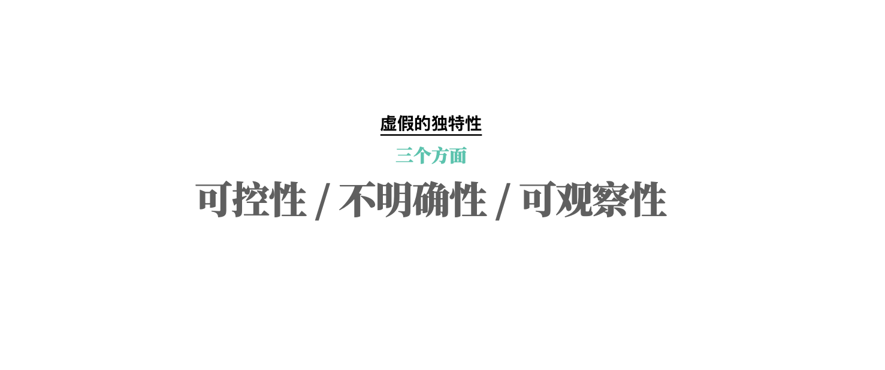  

- **可控性** - 可控带来的误区
    - **如果人们认为某种特质是可控的，他们则更有可能认为自己就该特质而言优于周围人**
        - 就比如说，我们会认为自己远比周围人更加具有**合作精神、斯文有礼和自律**（因为这些特质都是可控的）
          - 这里讲一个案例，就是开车，之前做过调研 80% 的司机都认为自己属于开车比较好的那一半，实际上有 30% 的人高估自己了，其实自己的驾驶水平并没有那么高，只不过自己不知道罢了
        - 而涉及相对不可控的特质时，他们则不会产生同等程度的优越感
          - 开头那个评估自己运动水平的问题，大部分人并不会出现高估的情况，因为大部分情况下，不是自己想跑的比较快，就可以跑出世界冠军的水平，而且这些大部分都是标准明确的
- **不明确性** - 以自我为中心的潜意识思维
    - 没有明确的定义的情况下，会高估自己的表现
    - 只评估了自己的优劣势，而没有评估他人的优劣势。
        - 如职位竞选经常会出现这种情况，选上了是自己能力够强，选不上是有行业黑幕，政治斗争。可能本质上只是自己没有他人优势明显
            - 管理学上也需要做到一定程度上的规章制度明确，无为而治可能会带来内耗
            - 这可能是一个很重要的人和人之间的矛盾来源，对这种表现有所意识
- **可观察性** - 不可观察带来的自利性
    - 行为越难观察，我们就越容易做出自利性的判断。跑得快慢我们评估一眼就能看出来，所以一般不会高估，但是内在的个人特征由于不可观察，我们往往由于无法观察他人的内心世界，导致我们陷入多数无知的陷阱（不知道别人怎么样）
        - 内在状态：认为自己比其他人更加严于律己、犹豫不决、腼腆、挑剔和局促不安
        - 外在状态：而不会认为自己比他人更加从容、整洁、好强、啰嗦或喜欢挖苦

### 道德优越感错觉

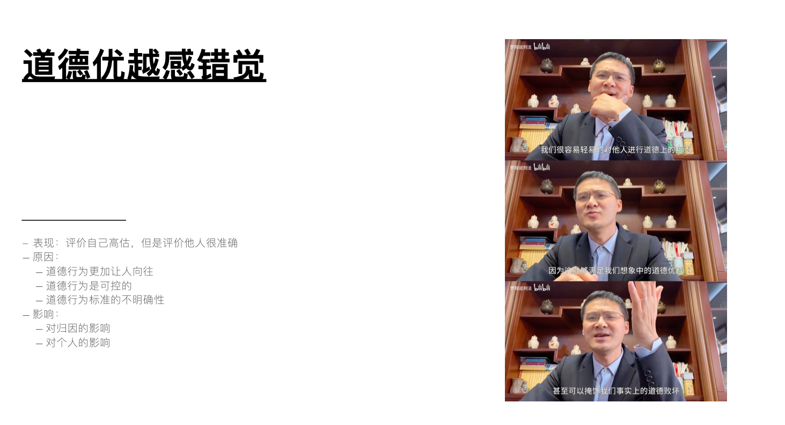  

- **评价自己高估，但是评价他人很准确（当局者迷**
    - 而这种情况在道德方面表现的最为明显
    - 在对威廉姆斯做道德方面的调查时，80%的学生表示自己拒绝抄袭其他人的考试答案，而他们认为仅有 56% 的其他学生同样会拒绝抄袭
- **原因**
    - 道德行为更加让人向往。我们都希望成为一个有道德的人
    - 道德行为是可控的
    - 道德行为标准的不明确性
- **影响**
    - 对归因的影响：过度谴责品行经受过考验的人
    - 对个人的影响：自称品行端正会促使当事人 政治、高尚的行事
        - 做出承诺后，更有可能实现期望
            - 打电话模拟采访印第安纳州卢明顿市的居民，48%的调查对象表示愿意贡献三小时时间为癌症协会募捐；对比组的真实采访中中，只有4%的人答应了；但是3天后，对实验组联系了那组之前接到电话对自己的行为作出预测的调查对象，表示是真实请求时，31%的人答应了

讲完了上述几个角度，我们有所理解，那么我们该如何客观的看待这个世界呢

## 如何更加客观的看待这个世界

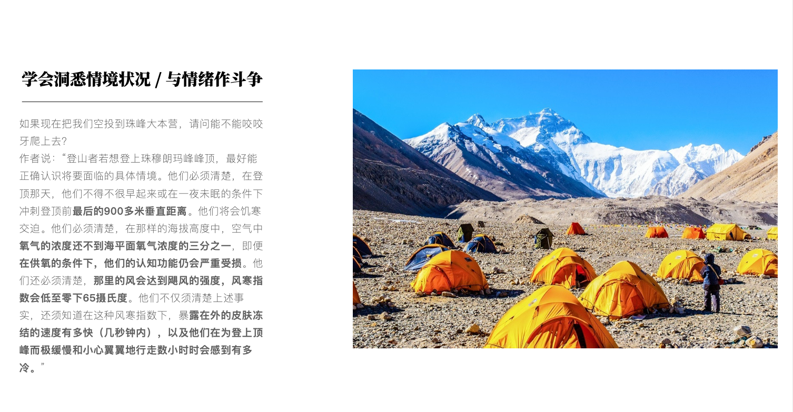  

- **学会洞悉情境状况**
    - **爬珠峰，并不是咬咬牙就可以爬上去。但是实际情况非常艰难**
    - 代入实际场景，做好充足准备，充分了解实际状况
    - 参考他人的数据
        - 参考历史数据；*以史为鉴，可以知兴替*
- **与情绪作斗争**
    - **回家如果发现浴缸里有一只鳄鱼，很多人可能感觉就应该是有点惊讶吧，别的没啥了。但实际上，要是正遇到了，可能都吓到说不出话**
    - 低估短期的情绪冲击之外，我们还会高估长期情绪对我们的影响。离婚半个月内受到极大的冲击，一年后绝对接受了

我们需要经常性的进行认知修正： **得出结论后，反方向的听听不同的意见。** 当你决定做一件事情的时候，一定要问身边的人，直到听到反对意见，你才能去做决策。

## 对我自己有什么改变

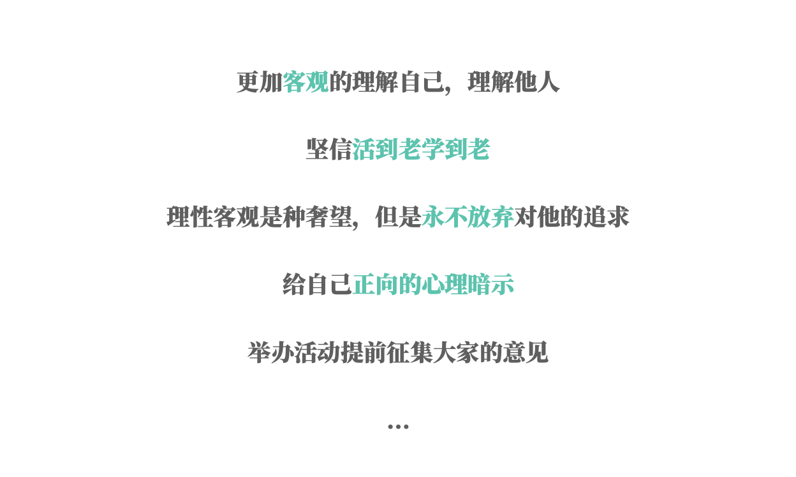  

- **进化带来的负面特性必然有其合理性**，比如太客观从而不够自信的祖先可能没找到对象hhh
    - 自信的好处
        - 乐观
        - 容易获得成就
        - 容易走出逆境
    - 普信总比自卑强吧
- **更加客观的理解自己，理解他人**
    - 不奢望所有人都相互理解，也包括自己也要接受自己不被所有人理解的事实
    - 这里介绍一下，我自己领悟的 **多元隧道理论**
      - 我一开始以为人只有两个频道一个好一个坏，但是后面我发现这两个频道并不存在，而是存在无数热评相互平行带偶尔交叉的隧道，他们相互转换相互变形，相互不受影响，相互不互相了解，相互都在这字的横截面那探索的世界，但是这并不影响他们的存在，也不影响他们认知和理解世界的模式，这就是我们每一个人
- **理性客观是种奢望，但是永远不放弃对他的追求**
- **坚信活到老学到老**
    - 人们在看待自己的问题时，并不是完全不准的。认知水平高，判断能力就更准一些
    - 不想掉入恶性循环，成为老了以后说出，我不懂但是 xxx 的那个人
    - 我知道的越多，我不知道的也越多，但是我知道的我不知道的就越少
- **给自己正向的心理暗示**
    - 办读书会，身边没有，那我就是最合适的人选哈哈哈
        - 希望能够召集很多对读书感兴趣的朋友，相互阅读相互分享，共同进步，人多了以后还可以办线下读书会，观影活动
- **举办活动提前征集大家的参与情况**。就像那个电话实验一样，做出过承诺的人往往更可能会遵守诺言

# 总结

认识你自己，凡事勿过度讲的是一件事，**不高估自己，不低估自己，实际上是一件非常有挑战的事情**

**这本书为大家介绍了在了解自我这个话题上，我们存在认知偏差的可怕事实，但同时也给我们带来了生活上的反思和智力上的启发。** 这个复杂的话题不是一本书就能改变的，但是我们能够开始有所觉知，就是一件好事

`认识自己是人类文明中永恒的话题，我也很庆幸人类能拥有这种自我审视的能力，能够让我们在在追求真理的道路上保持正确的方向`

最后也愿大家能够在这个永恒的话题中不断的发表自己的新见解，感谢大家的观看，希望分享的内容能让大家有所收获哈哈哈

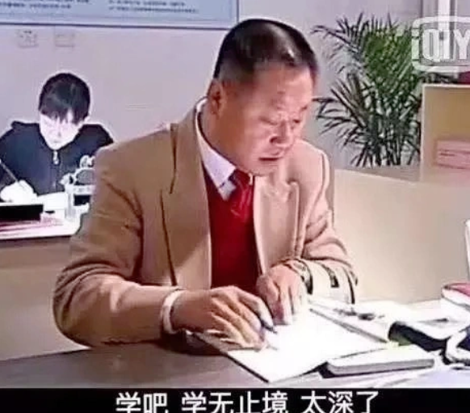  

# 其他

这是最后的读书交换环节（俊俊给我的明代的漕运还没来得及看🤣），大家带来的书的合影，比较可惜第一次讲的时间太长了，最后都忘记合影了哈哈哈，希望后面能学习到更多经验吧~

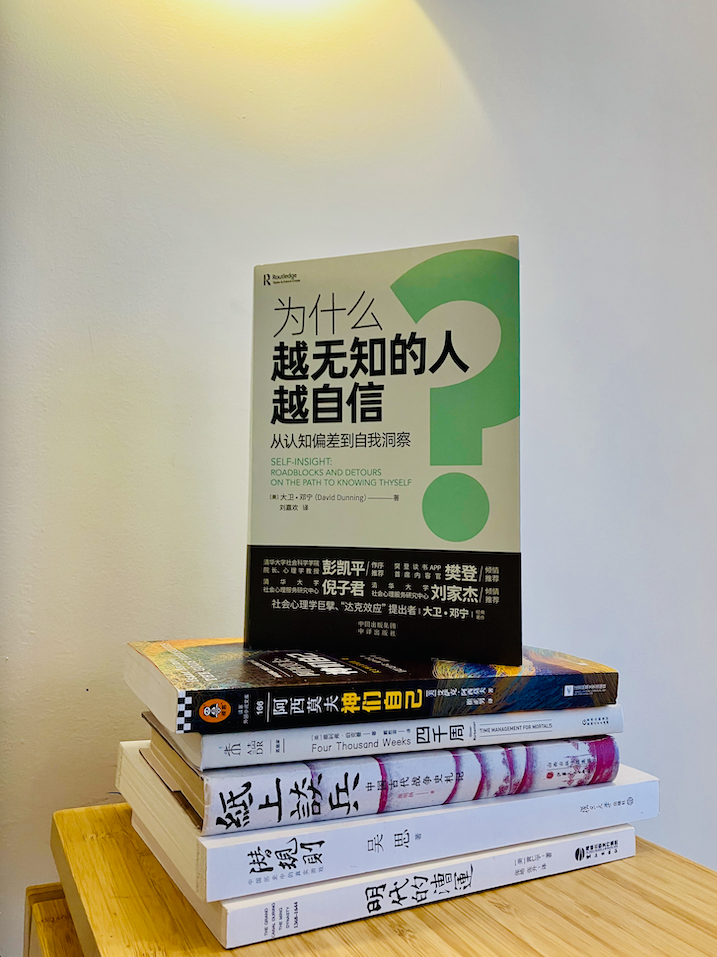  
